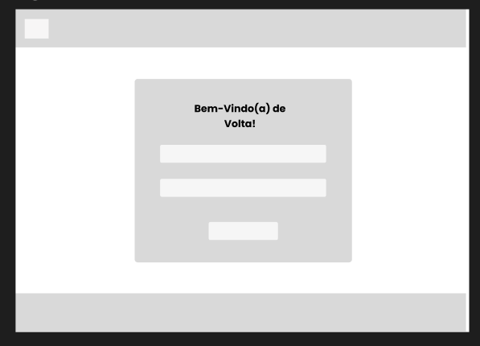

# Web Application Document - Projeto Individual - Módulo 2 - Inteli

## Planeja.ai

#### Sarah Araujo Duarte

## Sumário

1. [Introdução](#c1)  
2. [Projeto da Aplicação Web](#c2)  
3. [Desenvolvimento da Aplicação Web](#c3)  
4. [Referências](#c4)  

 

## 1. Introdução 

nbsp; &nbsp; &nbsp; &nbsp; O presente projeto apresenta um gerenciador de tarefas projetado para atender as necessidades de estudantes na organização de suas tarefas conforme suas necessidade. O sistema desenvolvido foi baseado na metodologia Kanban criado por Taiichi Ohno em 1940, tendo sua primeira implementação no sistema TOYOTA de produção. O mesmo conta com um workspace para que o usuário possa criar novos espaços para suas tarefas conforme suas necessidades, o sistema também possui um sistema de criação de tasks, categorias para atribuir a cada task, sendo possível dividir o espaço em colunas como: “a fazer”, “em andamento” e “concluído” por exemplo.

---

## 2. Projeto da Aplicação Web

### 2.1. Modelagem do banco de dados  

O Banco de Dados foi estruturado de modo que possa atender seus usuários de forma eficaz, garantindo o armazenamento seguro e organizado das informações essenciais para o funcionamento do sistema. Assim, abaixo é possível visualizar o Diagrama Lógico desenvolvido: 

 Fonte: material produzido pelo autor (2025).

### 2.1.1 BD e Models 

Usuários (userModel.js)

Gerencia as informações dos usuários cadastrados na plataforma.

Campos principais:

- nome
- profissao
- email
- senha
- foto_perfil

Funcionalidades:

create(user): Cadastra um novo usuário.

findAll(): Retorna todos os usuários.

findById(id): Busca um usuário pelo ID.

update(id, user): Atualiza os dados do usuário.

delete(id): Remove o usuário do sistema.

Categorias (categorias.js)

Permite a criação e gerenciamento de categorias para classificar tarefas.

Campos principais:

- nome
- cor

Funcionalidades:

create(categoria): Cria uma nova categoria.

findAll(): Lista todas as categorias.

findById(id): Busca uma categoria pelo ID.

update(id, categoria): Atualiza uma categoria.

delete(id): Exclui uma categoria.

Colunas (columns.js)

Estrutura visual das tarefas dentro de um workspace, estilo kanban.

Campos principais:

- workspace_id
- nome
- posicao

Funcionalidades:

create(column): Cria uma nova coluna.

findAll(): Lista todas as colunas.

findById(id): Retorna uma coluna específica.

update(id, column): Atualiza uma coluna.

delete(id): Exclui uma coluna.

Tarefas (tasks.js)

Controla o fluxo de tarefas, com associação a categorias.

Campos principais:

- titulo
- categorias_id
- tamanho
- status
- descricao

Funcionalidades:

create(task): Cria uma nova tarefa.

findAll(): Lista todas as tarefas.

findById(id): Busca uma tarefa pelo ID.

update(id, task): Atualiza uma tarefa.

delete(id): Exclui uma tarefa.

findAllWithCategoria(): Lista tarefas com os nomes das categorias associadas.

Relacionamento Usuário ↔ Tarefa (usersTasks.js)

Modela a relação muitos-para-muitos entre usuários e tarefas.

Funcionalidades:

assignTaskToUser(userId, taskId): Atribui uma tarefa a um usuário.

removeTaskFromUser(userId, taskId): Remove a atribuição de uma tarefa.

findTasksByUser(userId): Lista todas as tarefas atribuídas a um usuário.

findUsersByTask(taskId): Lista todos os usuários de uma tarefa.

### 2.2. Arquitetura 

### 2.3. Wireframes 

Os wireframes foram desenvolvidos para representar a estrutura básica e a disposição dos elementos da interface do Planeja.ai, focando na organização do conteúdo e navegação. É possível visualiza-los abaixo: 

 Fonte: material produzido pelo autor (2025).

 Fonte: material produzido pelo autor (2025).

 Fonte: material produzido pelo autor (2025).

 Fonte: material produzido pelo autor (2025).

 Fonte: material produzido pelo autor (2025).

### 2.4. Guia de estilos

O guia de estilos que pode ser visualizado na imagem abaixo, foi criado para padronizar a utilização de cores, tipografia e logo, afim de auxiliar durante o desenvolvimento dos protótipos e da plataforma. 

 Fonte: material produzido pelo autor (2025).

 Fonte: material produzido pelo autor (2025).

 Fonte: material produzido pelo autor (2025).

 Fonte: material produzido pelo autor (2025).

 Fonte: material produzido pelo autor (2025).

### 2.5. Protótipo de alta fidelidade 

O protótipo de alta fidelidade do Planeja.ai foi criado de forma que auxilie no desenvolvimento final da plataforma, servindo como norteador, sendo crucial para uma visualização prévia do que seria a plataforma e como seria estruturada. 

 Fonte: material produzido pelo autor (2025).

### 2.6. WebAPI e endpoints 

O endpoints principais da aplicação são: 

Autenticação

POST /login — Permite o login de usuários, validando email e senha.

POST /cadastro — Realiza o cadastro de novos usuários.

Usuários

GET /usuarios — Lista todos os usuários cadastrados.

GET /usuarios/:id — Retorna informações de um usuário específico.

PUT /usuarios/:id — Atualiza os dados de um usuário.

DELETE /usuarios/:id — Remove um usuário.

Tarefas

GET /tasks — Lista todas as tarefas.

GET /tasks/:id — Detalha uma tarefa específica.

POST /tasks — Cria uma nova tarefa.

PUT /tasks/:id — Atualiza uma tarefa.

DELETE /tasks/:id — Remove uma tarefa.

Categorias

GET /categorias — Lista todas as categorias.

GET /categorias/:id — Retorna uma categoria específica.

POST /categorias — Cria uma nova categoria.

PUT /categorias/:id — Atualiza uma categoria.

DELETE /categorias/:id — Remove uma categoria.

Colunas

GET /columns — Lista as colunas dos workspaces.

POST /columns — Cria uma nova coluna.

PUT /columns/:id — Atualiza uma coluna.

DELETE /columns/:id — Remove uma coluna.

Workspaces

GET /workspaces — Lista todos os workspaces.

POST /workspaces — Cria um novo workspace.

PUT /workspaces/:id — Atualiza um workspace.

DELETE /workspaces/:id — Remove um workspace.

Os endpoints retornam dados no formato JSON. Utilizando parâmetros de rota para identificar recursos específicos. Em caso de erros, retornam códigos HTTP apropriados (ex: 400, 401, 404, 500).

### 2.7 Interface e Navegação

O frontend do sistema foi desenvolvido utilizando HTML, CSS e JavaScript, com templates em EJS para facilitar a integração com o backend Node.js. A interface prioriza a usabilidade e simplicidade conforme os protótipos de alta fidelidade desenvolvidos que podem ser consultados na sessão 2.5. A navegação entre as páginas é realizada por links e redirecionamentos controlados pelo backend, garantindo uma experiência fluida e coerente para o usuário. O uso de componentes reutilizáveis e organização do código facilitam futuras manutenções e expansões.

---

## 3. Desenvolvimento da Aplicação Web 

### 3.1 Demonstração do Sistema Web (Semana 8)

Vídeo de demonstração: https://drive.google.com/drive/folders/19w-Gy0eVCmaL7j6cC29At8FhrCNN45Ix?usp=sharing

O sistema web foi desenvolvido utilizando uma arquitetura baseada em Node.js para o backend, com Express.js para gerenciamento de rotas e APIs RESTful, e PostgreSQL como banco de dados relacional. O frontend foi construído com templates EJS integrados ao servidor, utilizando HTML, CSS e JavaScript para criar uma interface responsiva e intuitiva.

Backend conta com: 

Modelos (Models): Implementação de models para usuários, categorias, colunas, tarefas e relacionamentos muitos-para-muitos (users_tasks), encapsulando operações CRUD e consultas específicas ao banco.

Controllers: Controllers organizados para lidar com autenticação, cadastro, gerenciamento de tarefas, categorias, colunas e workspaces, tratando a lógica de negócio.

Rotas: Definição de rotas RESTful para cada recurso, incluindo rotas públicas para login e cadastro, e rotas protegidas para gerenciamento das funcionalidades após autenticação.

Banco de Dados: Estruturação de tabelas normalizadas com chaves primárias, estrangeiras e relacionamentos adequados para suportar as funcionalidades do sistema.

Já o frontend conta com: 

Templates EJS: Criação de views dinâmicas que recebem dados do backend para exibição personalizada e atualizada.

Formulários: Páginas de login, cadastro, criação e edição de tarefas e categorias com validações básicas.

Estilos: Utilização de CSS personalizado para manter identidade visual leve e moderna, além da integração com ícones FontAwesome para melhor usabilidade.

As funcionalidades entregues são: 

- Autenticação e cadastro de usuários.
- Navegação dinâmica entre as principais áreas do sistema.
- Validação de dados e tratamento de erros nas operações.
- Redirecionamentos e feedbacks claros ao usuário durante o uso.

### 3.2 Conclusões e Trabalhos Futuros (Semana 8)

O desenvolvimento do sistema atingiu os objetivos principais propostos para esta etapa, entregando uma aplicação funcional básica. A arquitetura modular, com separação clara entre models, controllers e views, facilitou a organização do código e a manutenção. A interface construída com templates EJS apresentou boa usabilidade e foi pensada para oferecer uma experiência intuitiva ao usuário, mesmo em dispositivos móveis. Como pontos positivos é possível destacar a estruturação clara do back-end e a implementação das funcionalidades básicas do gerenciador de tarefas. Já os pontos de melhoria a destacar, contam com a interface que pode ser aprimoradas futuramente assim como o desenvolvimento de um sistema de criptografia para a segurança dos usuários.

## 4. Referências

https://www.totvs.com/blog/negocios/kanban/

---
---